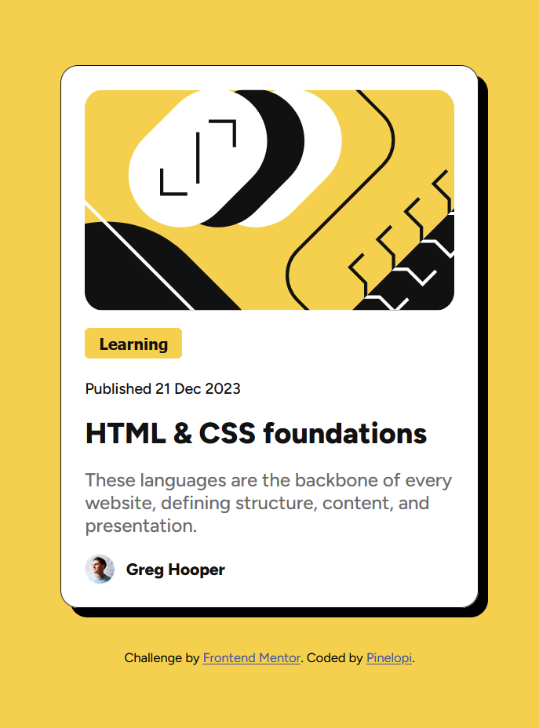

This is a solution to the [Blog preview card challenge on Frontend Mentor](https://www.frontendmentor.io/challenges/blog-preview-card-ckPaj01IcS).

  - [Screenshots](#screenshots)
  - [Built with](#built-with)
  - [Author](#author)

## Screenshots
The Desktop version:

The Mobile version:

The link in active state:

## Built with:
- Semantic HTML5 markup
- CSS custom properties
- CSS Flexbox

- Solution URL: 

## Author

- GitHub - [Pinelopi-Romeou](https://github.com/Pinelopi-Romeou)
- Frontend Mentor - [@Pinelopi-Romeou](https://www.frontendmentor.io/profile/Pinelopi-Romeou)
- Netlify URL: - [PinelopiRomeou](https://app.netlify.com/teams/pinelopi-romeou)
